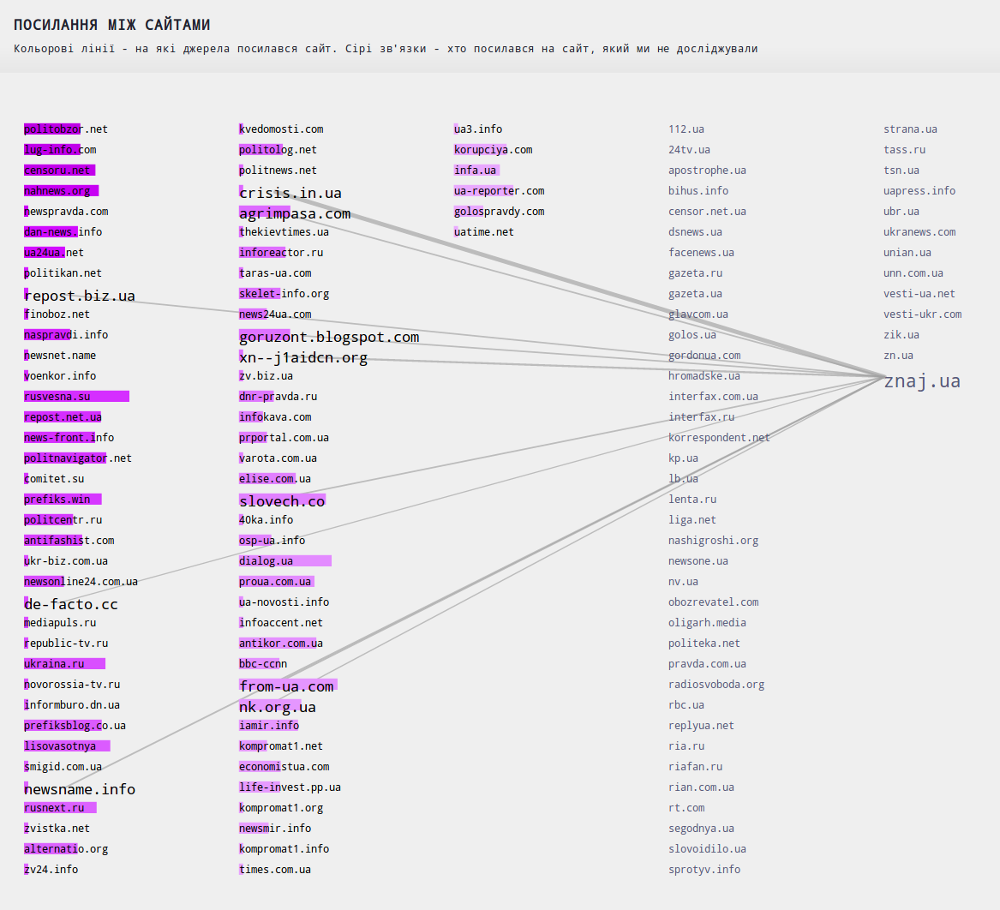
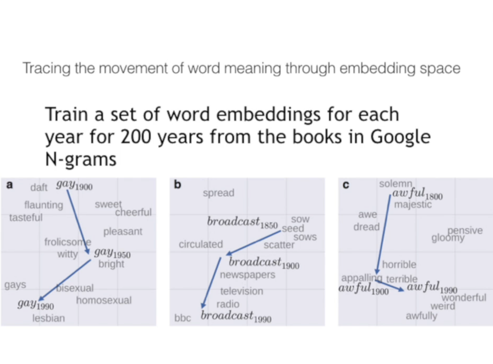

### Журналістика, соціальні науки, та методи NLP

  

# 1.  
[Форма історій. Існує 6 універсальних форм, аналіз близько 2000 класичних творів](http://www.bbc.com/culture/story/20180525-every-story-in-the-world-has-one-of-these-six-basic-plots). [Практичний приклад, R](https://juliasilge.com/blog/you-must-allow-me/)

      

# 2.

[StitchFix - моя улюблена фірма з продажі одягу](https://multithreaded.stitchfix.com/blog/)

      

# 3. 

[The Pudding, Коротка історія минулих 100 років](https://pudding.cool/2018/12/brief-history/)

      

# 4.

Самотній і сентиментальний (https://openai.com/blog/unsupervised-sentiment-neuron/), практичний [приклад](https://rakeshchada.github.io/Sentiment-Neuron.html). [Наш досвід](https://nadiarom.github.io/state_per_word/) 

      

# 5.

Наш проект про [сміттєві сайти](http://texty.org.ua/d/2018/mnews/)

      

# 6. 
[Як шукати тренди в новинах](https://www.tjpalanca.com/2017/03/facebook-news-topic-modeling.html) 

      

# 7. 
Декілька прикладів від Дана Журавського, [NLP для аналізу повсякденної мови](https://vimeo.com/193477678) 
 - Завдяки embedding ми можемо відслідковувати як змінюється значення слова із часом (є навіть формула, які слова найсильніше зміняться з часом?)
 - 

      

8. Фейки [GPT-2](https://openai.com/blog/better-language-models/), 
[TWDNE](https://www.gwern.net/TWDNE)

      

### Додатково
[Курс News Algorithms](https://journalismcourses.org/resource/alg0119.html) 

