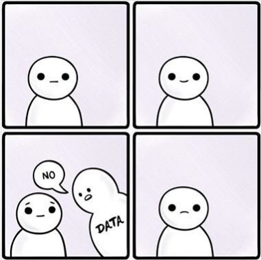
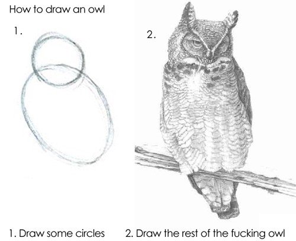

# Головна ідея використання візуалізації для аналізу даних:
Завжди показуйте стільки даних, скільки зможете - summary недостатньо!
(якщо даних занадто багато, використовуйте випадкову вибірку)

Приклад: всі набори даних, які ви зараз побачите, мають однакові підсумкові дані: однакові середні, стандартні відхилення, і навіть коефіцієнт кореляції


```{r, echo=FALSE, fig.height=8, fig.width=4}
library(tidyverse)
library(datasauRus)

ggplot(datasaurus_dozen, aes(x=x, y=y, colour=dataset))+
  geom_point()+
  theme_void()+
  theme(legend.position = "none")+
  facet_wrap(~dataset, ncol=3)


```


(Візуальний) аналіз даних - це непростий, інтерактивний процес, який до того ж вимагає фантазії. Все починається із запитань, які ви ставите для себе, і відповідь на які повинна бути в даних. Далі можуть виникнути наступні запитання, потім ще наступні - в цьтому і є інтерактивність.

Що ви отримуєте за допомогою такого аналізу? 

* Розуміння як влаштовані ваші дані
* Можна побачити якісні властивості даних, а не лише велику таблицю з числами
* Якщо пощастить, знайти нові патерни, або асоціації

Не пощастило:


### Мистецтво ставити питання

Які запитання найчастіше найбільш корисні для такого аналізу?

Питання | Візуальний аналіз
------- | -----------------
Як саме змінюється ваша змінна | Розподіл, тренд (для даних з часом)
Які точки виходять за межі (outliers) | Краї розподілу
Як пов"язані ваші змінні? | графік розсіяння, матриця розсіяння
Чи можемо ми спростувати / підтвердити гіпотезу ... | ... в залежності від гіпотези, але найчастіше - графік розсіяння у якісь формі
 
Ок, я згоден що перехід між третьою та четвертою строками схожий на цю картинку:


але нічого кращого запропонувати не можу - навчитися задавати правильні питання та перевіряти візуалізацією можна лише після деякої практики 
 


### Практика
Завантажте та розархівуйте цей [набір даних](http://z.texty.org.ua/data/protocols.unnested.csv.gz) 

#### Дані
```{r}
library(readr)
protocols_unnested <- read_csv("~/code/presentation_tapas/data/protocols.unnested.csv", 
  col_types = cols(date = col_skip(), docs = col_skip(), 
  file = col_skip(), firm = col_skip(), 
  notes = col_skip(), price = col_skip()))

# filter
df <- protocols_unnested %>%
  filter(price.extr < 10^8) %>%
  filter(purchase_cost_uah > 0 ) %>%
  filter(!is.na(purchase_cost_uah) )
```


### Список питань

1. Скільки разів учасники перемагали(катег. змінна)
2. З яких регіонів переможці? 
3. Якою була ціна угод?
4. Скільки претендентів брали участь у торгах?
5. Залежність ціни від кількості учасників?


#### Питання №1: cкільки разів учасники перемагали
```{r, eval=FALSE, message=FALSE, warning=FALSE, include=FALSE}

nuke_xlabels <-  theme(axis.title.x=element_blank(),
        axis.text.x=element_blank(),
        axis.ticks.x=element_blank())

df %>%
  filter(!is.na(code))  %>%
  ggplot(aes(x = code)) + geom_histogram(stat="count") + nuke_xlabels + ylim(0, 200)
```


Переможці
```{r}
# df %>%
#   filter(!is.na(code))  %>%
#   filter(winner) %>%
#   ggplot(aes(x = code)) + geom_histogram(stat="count") + nuke_xlabels + ylim(0, 200)

df %>%
  filter(!is.na(code))  %>%
  filter(winner) %>%
  ggplot() + 
  geom_bar(mapping = aes(x = code)) +  nuke_xlabels + ylim(0, 200)

```

### Питання 2 - регіони - переможці

```{r}
df %>%
  filter(!is.na(winner_region_id))  %>%
  filter(winner == "TRUE" ) %>%
  ggplot() + 
  geom_bar(mapping = aes(x = winner_region_id))

```


#### Питання №3: якою була ціна угод?
```{r}
df %>%
  ggplot() +
  geom_freqpoly(aes(x = price.extr))
```


#### Питання №4 Скільки претендентів брали участь у торгах?

```{r}
df %>%
  group_by(contract_id) %>%
  summarise(participants = n()) %>%
  arrange(desc(participants))
  
```

... Але графік - краще!
```{r}

df %>%
  group_by(contract_id) %>%
  summarise(participants = n()) %>%
  arrange(desc(participants)) %>%
  ggplot(aes(x = participants)) + geom_histogram(stat="count") 
  

```


### Питання №5: Залежність ціни від кількості учасників

```{r, echo=FALSE, message=FALSE, warning=FALSE}
df %>%
  filter(lowest.price.won == 'TRUE') %>%
  group_by(contract_id) %>%
  summarise(participants = n(), deal_price = min(price.extr), announce_price = max(purchase_cost_uah) ) %>%
  ggplot( aes( x = log(deal_price + 1), y = log(announce_price+1), 
                        colour = participants > 2) ) +
  geom_point(alpha = 0.2, stroke = 0 ) + ylim(0, 20)
  

df %>%
  filter(lowest.price.won == 'TRUE') %>%
  group_by(contract_id) %>%
  summarise(participants = n(), deal_price = min(price.extr), announce_price = max(purchase_cost_uah) ) %>%
  ggplot( aes( x = deal_price, y = announce_price, 
                        colour = participants > 2) ) +
  geom_point(alpha = 0.4, stroke = 0 ) + ylim(0, 2.5e+07) + xlim(0, 2.5e+07)


```


***
Отже, скаттерплоти та розподіли - це наше все ... насамкінець, рпо те що є класний спосіб подивитися все на одній картинці: матриця скатерплотів 

```{r}
library(GGally)
df %>%
  ggpairs( columns = c("volume_uah", "price.extr") )
```


Або на іншому датасеті:
```{r, echo=FALSE, message=FALSE, warning=FALSE}
ggpairs(iris[1:4])
```


