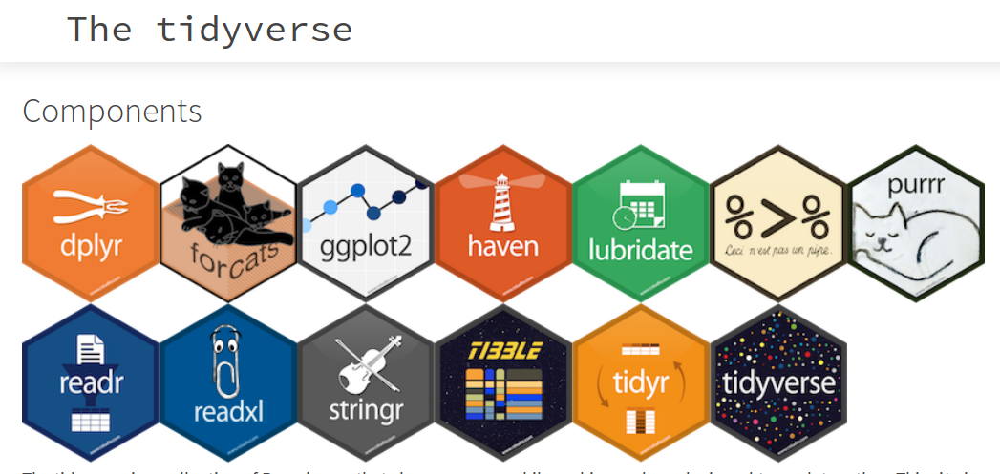

1
<br>
<br>
<br>
<br>
<br>

## Лайфхаки для роботи з відкритими даними
### Анатолій Бондаренко
### Texty.org.ua
### @dvrnd

<br>
<br>
<br>
<br>
<br>
<br>
<br>

_____
2
<br>
<br>
<br>
<br>
<br>
<br>
<br>

### Використовуйте той інструмент, який дозволить вам 
### найшвидше спробувати дуже багато різних варіантів

<br>
<br>
<br>
<br>
<br>
<br>
<br>

______

3
<br>
<br>
<br>
<br>
<br>
<br>
<br>

### Найкращий спосіб зробити візуалізацію у Python: 
```
$ python  
>>> exit()
$ rstudio  
```

<br>
<br>
<br>
<br>
<br>
<br>
<br>

______

4

<br>
<br>
<br>
<br>
<br>
<br>
<br>





<br>
<br>
<br>
<br>
<br>
<br>
<br>

______

5

<br>
<br>
<br>
<br>
<br>
<br>
<br>


## tidyverse.org
_Додайте сюди Rstudio з RMarkdown & RNotebooks, і маємо "самодостатній" всесвіт для роботи з даними, візуалізації та перевірки чужих результатів_

<br>
<br>
<br>
<br>
<br>
<br>
<br>

______

6
<br>
<br>
<br>
<br>
<br>
<br>
<br>

### dplyr
Функції у dplyr, майже без милиць і розпорок
```R
my_summarise <- function(df, group_by) {
  # більше того, group_by_at()  дозволяє навіть обійтись без пари "enquo() + !!"
  group_by <- enquo(group_by)  

  df %>%
    group_by(!!group_by) %>%
    summarise(a = mean(a))
}
```
<br>
<br>
<br>
<br>
<br>
<br>
<br>

______

7


### ggplot extensions

- ggraph
- gganimate
- geofacet


<br>

- ggjoy

<br><br>


_________

8
<br>
<br>
<br>
<br>
<br>
<br>
<br>

### інтерактивні графіки та карти
- plotly (навіть в 3D)
- htmlwidgets (див. напр. тут: https://paldhous.github.io/NICAR/2017/r-to-javascript.html)

<br>
<br>
<br>
<br>
<br>
<br>
<br>

________

9

<br>
<br>
<br>
<br>
<br>
<br>
<br>

### Посилання
* ця доповідь https://github.com/devrand/tapas270717
* різні інструменти http://bit.ly/12uokPm

<br>
<br>
<br>
<br>
<br>
<br>
<br>

________


